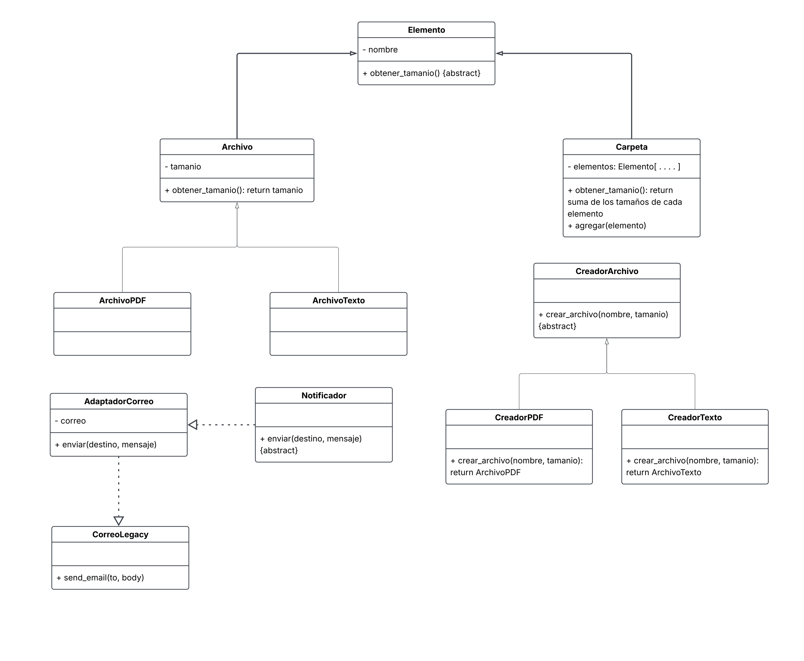

# ANALISIS - Práctica 3

## 1. Qué hace cada parte del código inicial

1. El método agregar_archivo se encarga de:  
Recibir una instancia de Carpeta junto con el tipo, nombre y tamaño de un archivo, decidir qué tipo de objeto crear (ArchivoPDF o ArchivoTexto), e insertarlo directamente en la lista de archivos de esa carpeta.

2. El método obtener_tamanio se encarga de:
Sumar primero el tamaño de todos los archivos contenidos en el nivel actual y luego recorrer e invocar la misma función sobre cada una de las subcarpetas de su lista.

3. El método enviar_resultado se encarga de:
Calcular el tamaño total de la carpeta, crear el correo (CorreoLegacy) y mandar el mensaje al destinatario.

## 2. Tres problemas concretos

Problema 1: La carpeta guarda archivos y subcarpetas en dos listas separadas.
- Dónde aparece: en la clase Carpeta (las listas archivos y subcarpetas) y en obtenerTamanio, que tiene un for para cada lista.
- Qué cambio sería difícil: si algún día hay un tercer tipo de cosa dentro de una carpeta (por ejemplo, un acceso directo), habría que crear otra lista y otro for, y cambiar todo el código que usa la carpeta.
- Qué debería hacerse responsable: una interfaz común llamada Elemento, con el método obtenerTamanio(). Archivo y Carpeta la usarían, y la carpeta tendría una sola lista de elementos (patrón Composite).

Problema 2: Un solo lugar decide qué tipo de archivo crear, con if/else.
- Dónde aparece: en el método agregarArchivo, que revisa si el tipo es "pdf" o "txt".
- Qué cambio sería difícil: si queremos un tercer tipo de archivo (por ejemplo, "docx"), hay que abrir ese método y modificarlo. Eso se repite con cada tipo nuevo. Además, el mismo método mezcla dos trabajos: crear el archivo y guardarlo.
- Qué debería hacerse responsable: una clase CreadorArchivo con un creador para cada tipo (CreadorPDF y CreadorTexto). Cada uno sabe construir su propio archivo (patrón Factory Method).

Problema 3: El programa depende directamente del correo viejo.
- Dónde aparece: en enviarResultado, que crea un CorreoLegacy y llama a send_email.
- Qué cambio sería difícil: si cambiamos de proveedor de correo y su método se llama distinto, hay que reescribir enviarResultado. Tampoco se puede probar sin usar el correo real.
- Qué debería hacerse responsable: una interfaz Notificador con el método enviar(), y una clase AdaptadorCorreo que traduzca enviar() a send_email() (patrón Adapter).

## 3. Etapa 6: Comprobación de la solución

### 3.1 Los cinco casos de la etapa 2

Se ejecutaron con `pytest -v` en la rama main (código refactorizado).
"Antes" son los resultados del commit ee749bd (código original).

1. Carpeta vacía
   - Entrada: carpeta sin archivos ni subcarpetas
   - Esperado: 0
   - Obtenido antes: 0 | Obtenido después: 0
   - Coincide: sí (OK)

2. Carpeta con un PDF de 120
   - Entrada: practica.pdf (120)
   - Esperado: 120
   - Obtenido antes: 120 | Obtenido después: 120
   - Coincide: sí (OK)

3. Carpeta con PDF de 120 y texto de 80
   - Entrada: practica.pdf (120) y notas.txt (80)
   - Esperado: 200
   - Obtenido antes: 200 | Obtenido después: 200
   - Coincide: sí (OK)

4. Ejemplo completo con subcarpeta de 50
   - Entrada: MyP con practica.pdf (120), notas.txt (80) y la subcarpeta
     Ejemplos con ejemplo.txt (50)
   - Esperado: 250
   - Obtenido antes: 250 | Obtenido después: 250
   - Coincide: sí (OK)

5. Carpeta con un archivo de tamaño 0
   - Entrada: texto.txt (0)
   - Esperado: 0
   - Obtenido antes: 0 | Obtenido después: 0
   - Coincide: sí (OK)

Resultado de pytest -v después de refactorizar: 9 passed (los cinco casos anteriores, las dos pruebas de validación y las dos de los creadores).

Nota sobre las pruebas de validación: en el código original dieron FALLO (DID NOT RAISE ValueError) porque no existía la validación de nombres vacíos ni de tamaños negativos. Se agregó como cambio extra del equipo y ahora dan OK. Los cinco casos de tamaño dieron OK antes y después.

### 3.2 Ejecución de main

Se ejecutó `python main.py` antes y después de refactorizar.

Salida antes (commit ee749bd):

    250
    Para: profesor@universidad.edu
    Tamanio total: 250

Salida después (rama main):

    250
    Para: profesor@universidad.edu
    Tamanio total: 250

Coincide: sí. El tamaño total y el correo simulado conservan los resultados originales.

### Etapa 3: Composite
- Se creó la clase Elemento. Todo Elemento sabe decir su tamaño con obtener_tamanio().
- Archivo y Carpeta usan Elemento.
- Carpeta ahora tiene una sola lista (elementos) en lugar de dos.
- El cálculo del tamaño pasó de la función suelta a un método de Carpeta.
  Ya no se pregunta si algo es archivo o carpeta: cada uno responde su
  propio tamaño.

### Etapa 4: Factory Method
- Se creó CreadorArchivo, con dos creadores: CreadorPDF y CreadorTexto.
- Cada creador sabe construir un solo tipo de archivo y lo devuelve.
- Se borró la función agregar_archivo y su if/elif. Ahora la carpeta solo guarda archivos; ya no los crea.
- Si hubiera un tercer tipo de archivo, solo se agregaría un creador nuevo, sin tocar el código que ya existe.

### Etapa 5: Adapter
- Se creo la interfaz Notificador con el metodo enviar(destino, mensaje).
- Se creo AdaptadorCorreo, que guarda un CorreoLegacy y traduce enviar() a send_email(). CorreoLegacy no se modifico.
- enviar_resultado ahora recibe un Notificador en lugar de crear el correo directamente. Si cambiamos de proveedor de correo, solo se agrega o cambia un adaptador.
  
### Cambios extra del equipo
- Validaciones que lanzan ValueError: Elemento no acepta nombres vacios ni None, Archivo no acepta tamanios negativos, Carpeta.agregar no acepta None y AdaptadorCorreo no acepta un destino vacio o sin "@".
- Ninguna cambia el ejemplo de la practica, porque todos sus nombres, tamanios y destino son validos.
- Pruebas extra: dos de validacion (nombre vacio y tamanio negativo) y dos de los creadores.

## 5. Diagrama final

## 6. Respuestas finales

¿Qué responsabilidad se movió a cada clase?
- elemento.py: Se responsabiliza de guardar el nombre del elemento, checar que no esté vacío y definir la regla para pedir el tamaño.
- archivo.py: Guarda el tamaño del archivo, valida que sea de valor válido y lo devuelve. ArchivoPDF y ArchivoTexto son los tipos de archivo específicos.
- carpeta.py: Guarda la lista de archivos y subcarpetas que tiene adentro, checa que no le agreguen elementos nulos y suma el tamaño de todo lo que contiene.
- creador_archivo.py: Junto con CreadorPDF y CreadorTexto, se encargan de crear los archivos para evitar que se usen condicionales en el código principal.
- notificador.py: Define la forma estándar en la que el programa debe enviar notificaciones.
- adaptador_correo.py: Traduce el método de envío (enviar()) al método viejo (send_email()) de CorreoLegacy y revisa que el correo tenga un formato válido.

¿Qué permaneció igual para quien usa el programa?
- El cálculo del tamaño total de las carpetas y archivos da el mismo resultado, las pruebas siguen pasando con los mismos datos y el correo muestra en la pantalla la misma salida (Para: profesor@universidad.edu y Tamanio total: 250).